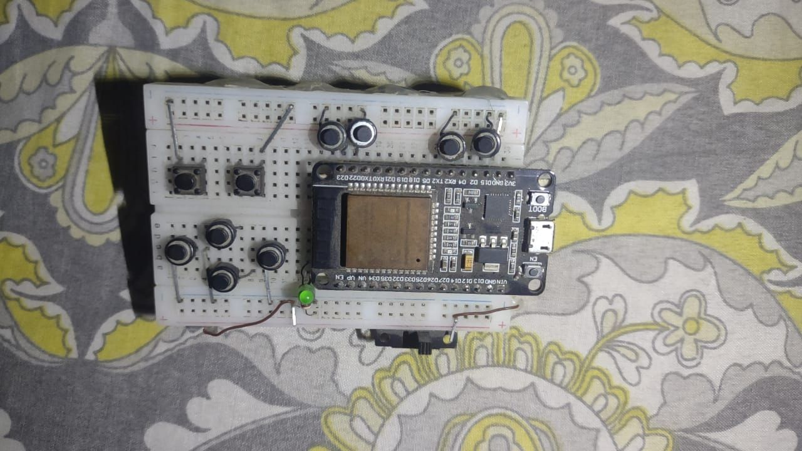
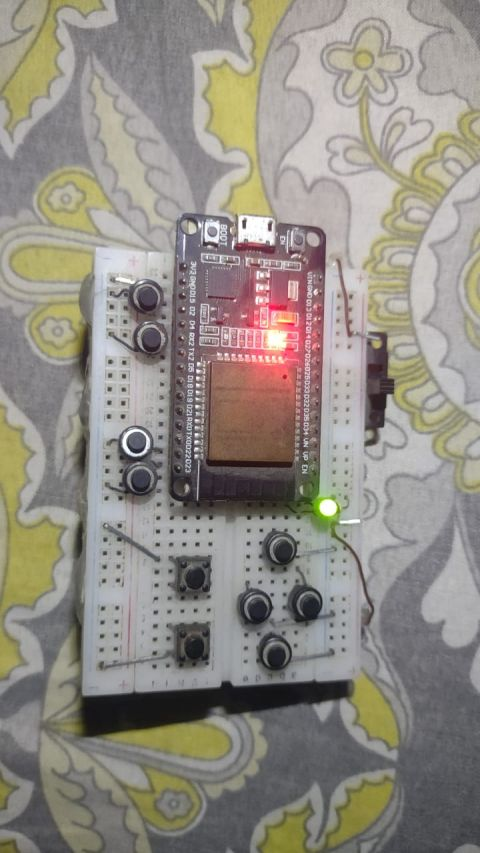
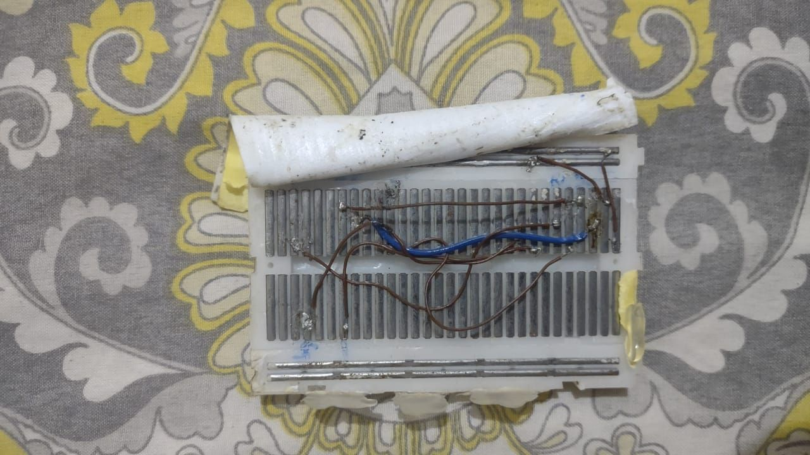
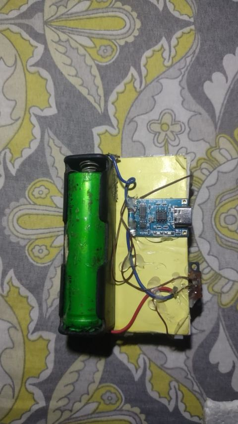

# ESP32 Sega-Style BLE Controller

Build a Bluetooth Low Energy game controller with an ESP32, arcade-style buttons, and a small desktop tester app. The controller pairs with Windows, Android, Linux, and other BLE HID hosts as a normal input device.

<p align="center">
  
</p>

## Highlights

- ESP32 BLE HID firmware
- 4-way D-pad with diagonal support
- 12 mapped gameplay buttons
- Active-low button wiring with ESP32 internal pull-ups
- Python desktop tester for checking D-pad, buttons, and analog axes
- Works as a standard Bluetooth input device after pairing

## Build Photos

<p align="center">
  
  
</p>

<p align="center">
  
  
</p>

## Hardware

- ESP32 development board
- 12 to 16 momentary push buttons
- Jumper wires
- Common GND wiring
- Optional battery and charging module

Each button connects one GPIO pin to GND when pressed. The firmware enables `INPUT_PULLUP`, so external pull-up resistors are not required for normal short wiring.

## Pin Map

| Control | GPIO |
| --- | ---: |
| D-Pad Up | 13 |
| D-Pad Down | 12 |
| D-Pad Left | 14 |
| D-Pad Right | 5 |
| Triangle | 15 |
| Circle | 4 |
| Cross | 22 |
| Square | 23 |
| L1 | 32 |
| L2 | 33 |
| R1 | 26 |
| R2 | 27 |
| L3 | 18 |
| R3 | 19 |
| Start | 25 |
| Select | 21 |

## Firmware Setup

1. Install the Arduino IDE.
2. Install ESP32 board support from Espressif.
3. Install the lemmingDev BLE HID Arduino library.
4. Open `esp32blecontroller/esp32blecontroller.ino`.
5. Select your ESP32 board.
6. Upload the sketch.
7. Pair the controller from your computer or phone Bluetooth settings as `BLE Controller`.

## Test On PC

No extra Python packages are required. Run the desktop tester:

```bash
python main.py
```

For a quick terminal check without opening the GUI:

```bash
python main.py --self-test
```

The tester lets you select from connected input devices exposed by Windows. If no controller appears, make sure the Bluetooth device is paired and connected in the operating system settings first.

## Project Files

| Path | Purpose |
| --- | --- |
| `esp32blecontroller/esp32blecontroller.ino` | ESP32 BLE HID firmware |
| `Controller Tester/controller_tester.py` | Desktop controller tester app |
| `main.py` | Convenience launcher for the tester |
| `requirements.txt` | Python dependencies |
| `Images/` | Demo GIF and build photos |
| `LICENSE` | MIT License |
| `NOTICE.md` | Attribution note |

## Notes

The older files in `delete/` are preserved as development notes and experiments.
